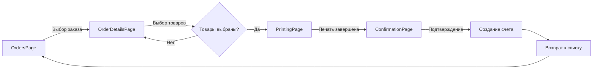

# План реализации Workflow упаковки и создания счетов-фактур

## 📋 Обзор
**Дата:** 16 августа 2025  
**Цель:** Реализация полного цикла упаковки заказов с автоматическим созданием счетов-фактур  
**Важно:** Использование только безопасных методов API, без прямого создания документов

## 🎯 Требования бизнес-процесса

### Текущая проблема
При нажатии на кнопку "Упаковать" просто появляется галочка, но нет перехода к печати этикеток и финализации заказа.

### Желаемый процесс
1. **Выбор заказа** → Страница со списком заказов
2. **Детали заказа** → Просмотр товаров и выбор для упаковки
3. **Печать этикеток** → Автоматический переход после выбора товаров
4. **Подтверждение упаковки** → Финальная страница с созданием счета-фактуры

## 🔄 Детальный Workflow

### Этап 1: Список заказов (OrdersPage)
```
Страница: /orders
Действия:
- Просмотр списка заказов со статусом "Ожидает"
- Фильтрация по дате и клиенту
- Кнопка "Упаковать" → переход к деталям
```

### Этап 2: Детали заказа и выбор товаров (OrderDetailsPage)
```
Страница: /orders/:id
Действия:
- Отображение всех товаров заказа
- Выбор доступных товаров
- Указание упакованного количества
- Кнопка "Далее к печати" → автоматический переход
```

### Этап 3: Печать этикеток (PrintingPage)
```
Страница: /orders/:id/print
Действия:
- Автоматическое распределение по коробкам
- Генерация и печать этикеток коробок
- Печать этикеток товаров
- Печать накладной
- Кнопка "Завершить упаковку" → переход к подтверждению
```

### Этап 4: Подтверждение и создание счета (ConfirmationPage)
```
Страница: /orders/:id/confirm
Действия:
- Сводка упакованных товаров
- Проверка данных клиента
- Кнопка "Подтвердить упаковку!" → создание счета-фактуры
- Обновление статуса в RIVHIT
```

## 📊 Схема переходов между страницами



## 🔐 API операции для создания счета-фактуры

### Безопасный подход (РЕКОМЕНДУЕТСЯ)

Согласно документации RIVHIT и ограничениям системы, мы НЕ можем напрямую создавать документы через API. Вместо этого используем следующий подход:

#### 1. Подготовка данных для счета
```typescript
interface InvoicePreparation {
  orderId: number;           // ID заказа (document_type: 7)
  customerId: number;        // ID клиента
  packedItems: {
    itemId: number;
    quantity: number;
    price: number;
  }[];
  packingDate: Date;
  operatorId: string;
}
```

#### 2. Использование Document.Close для завершения заказа
Согласно API RIVHIT, есть метод `Document.Close` который может быть использован для:
- Закрытия заказа
- Автоматического создания связанных документов
- Обновления статуса

```typescript
// Предполагаемое использование (требует проверки с RIVHIT)
async function closeOrderAndCreateInvoice(orderId: number) {
  const endpoint = '/Document.Close';
  const params = {
    api_token: API_TOKEN,
    document_id: orderId,
    document_type: 7,  // Order
    create_invoice: true,  // Флаг для создания счета
    packed_items: [...],   // Фактически упакованные товары
  };
  
  // Этот вызов должен:
  // 1. Закрыть заказ
  // 2. Создать счет-фактуру на основе упакованных товаров
  // 3. Вернуть ID нового счета
  const response = await rivhitAPI.post(endpoint, params);
  return response.invoice_id;
}
```

#### 3. Альтернатива - использование Document.NewExtended
Если `Document.Close` не создает счет автоматически, можно использовать `Document.NewExtended` для создания счета с квитанцией:

```typescript
async function createInvoiceFromOrder(orderData: any) {
  // ВАЖНО: Это операция записи, требует специальных прав
  const endpoint = '/Document.NewExtended';
  const params = {
    api_token: API_TOKEN,
    document: {
      document_type: 2,  // Invoice
      reference_document: orderData.document_id,  // Ссылка на заказ
      customer_id: orderData.customer_id,
      items: orderData.packed_items,
      // ... другие поля
    },
    receipt: {
      amount: orderData.total_amount,
      payment_method: 'pending',  // Ожидает оплаты
    }
  };
  
  // Создает счет и квитанцию одновременно
  const response = await rivhitAPI.post(endpoint, params);
  return response;
}
```

## 🛡️ Безопасная реализация для нашей системы

### Рекомендуемый подход:

1. **НЕ создавать документы напрямую через API**
2. **Использовать флаги и метаданные для маркировки**
3. **Позволить менеджеру создавать счета вручную в RIVHIT**

### Реализация:

```typescript
// services/packing-completion.service.ts

export class PackingCompletionService {
  
  /**
   * Завершение упаковки БЕЗ создания счета
   * Только маркировка и подготовка данных
   */
  async completePackingWithoutInvoice(orderId: number, packingData: any) {
    // 1. Обновляем локальный статус
    await this.updateLocalOrderStatus(orderId, 'packed');
    
    // 2. Сохраняем данные упаковки
    await this.savePackingData(orderId, {
      packedAt: new Date(),
      packedBy: packingData.operatorId,
      items: packingData.items,
      boxes: packingData.boxes,
      labels: packingData.printedLabels
    });
    
    // 3. Подготавливаем данные для будущего счета
    const invoiceData = this.prepareInvoiceData(packingData);
    await this.cacheService.set(
      `pending_invoice:${orderId}`, 
      invoiceData,
      86400  // Храним 24 часа
    );
    
    // 4. Отправляем уведомление менеджеру
    await this.notifyManager(orderId, 'ready_for_invoice');
    
    return {
      success: true,
      orderId,
      status: 'packed_pending_invoice',
      invoiceData  // Для отображения в UI
    };
  }
  
  /**
   * Проверка существования счета для заказа
   */
  async checkInvoiceExists(orderId: number): Promise<boolean> {
    try {
      // Ищем счет по reference на заказ
      const documents = await this.rivhitService.getDocuments({
        document_type: 2,  // Invoice
        reference: String(orderId)
      });
      
      return documents.length > 0;
    } catch (error) {
      console.error('Error checking invoice:', error);
      return false;
    }
  }
  
  /**
   * Подготовка данных для счета (без создания)
   */
  private prepareInvoiceData(packingData: any) {
    return {
      document_type: 2,
      reference_order: packingData.orderId,
      customer: {
        id: packingData.customerId,
        name: packingData.customerName,
        vat: packingData.customerVat,
        address: packingData.customerAddress
      },
      items: packingData.items.map(item => ({
        item_id: item.id,
        description: item.description,
        quantity: item.packedQuantity,  // Фактически упакованное
        unit_price: item.price,
        tax_rate: 0.17,  // НДС 17%
        line_total: item.packedQuantity * item.price * 1.17
      })),
      totals: {
        subtotal: this.calculateSubtotal(packingData.items),
        vat: this.calculateVAT(packingData.items),
        total: this.calculateTotal(packingData.items)
      },
      packing_info: {
        packed_at: new Date(),
        packed_by: packingData.operatorId,
        boxes_count: packingData.boxes.length,
        labels_printed: packingData.labelsCount
      },
      notes: `Упаковано ${new Date().toLocaleDateString('he-IL')}`
    };
  }
}
```

## 🎨 UI компоненты для реализации

### 1. Обновленная кнопка "Упаковать"
```typescript
// components/PackButton.tsx
const handlePackClick = async () => {
  // Сохраняем выбранные товары
  await saveSelectedItems(items);
  
  // Автоматический переход к печати
  navigate(`/orders/${orderId}/print`);
};
```

### 2. Страница печати с автозагрузкой
```typescript
// pages/PrintingPage.tsx
useEffect(() => {
  // Автоматически начинаем процесс печати при загрузке
  if (selectedItems.length > 0) {
    startPrintingProcess();
  }
}, [selectedItems]);
```

### 3. Страница подтверждения
```typescript
// pages/ConfirmationPage.tsx
const handleConfirmPacking = async () => {
  // Завершаем упаковку
  const result = await packingService.completePackingWithoutInvoice(
    orderId,
    packingData
  );
  
  // Показываем результат
  if (result.success) {
    Modal.success({
      title: 'Упаковка завершена',
      content: (
        <div>
          <p>Заказ #{orderId} успешно упакован</p>
          <p>Счет-фактура будет создан менеджером</p>
          <p>Данные для счета подготовлены</p>
        </div>
      ),
      onOk: () => navigate('/orders')
    });
  }
};
```

## 📝 Навигация и роутинг

### Обновление роутов
```typescript
// App.tsx
<Routes>
  <Route path="/orders" element={<OrdersPage />} />
  <Route path="/orders/:id" element={<OrderDetailsPage />} />
  <Route path="/orders/:id/print" element={<PrintingPage />} />
  <Route path="/orders/:id/confirm" element={<ConfirmationPage />} />
</Routes>
```

### Состояние между страницами
```typescript
// store/packing.store.ts
interface PackingState {
  currentOrderId: number | null;
  selectedItems: PackingItem[];
  boxes: PackingBox[];
  printedLabels: PrintedLabel[];
  invoiceData: InvoicePreparation | null;
  
  // Actions
  setSelectedItems: (items: PackingItem[]) => void;
  addPrintedLabel: (label: PrintedLabel) => void;
  setInvoiceData: (data: InvoicePreparation) => void;
  reset: () => void;
}
```

## ⚠️ Важные ограничения

1. **НЕ используем Document.New** - это запрещенный метод
2. **НЕ создаем счета напрямую** - только подготовка данных
3. **НЕ изменяем документы в RIVHIT** - только чтение
4. **ИСПОЛЬЗУЕМ Document.Close** - если разрешено для закрытия заказов
5. **СОХРАНЯЕМ данные локально** - для последующей синхронизации

## 🔍 Требуется уточнение от RIVHIT

1. **Document.Close** - создает ли автоматически счет при закрытии заказа?
2. **Document.Update** - существует ли этот endpoint? (не найден в документации)
3. **Права доступа** - какие операции разрешены для нашего API токена?
4. **Workflow** - официальный процесс конвертации заказа в счет?

## 📋 Checklist для реализации

- [ ] Создать страницу PrintingPage с автозагрузкой
- [ ] Создать страницу ConfirmationPage
- [ ] Обновить навигацию между страницами
- [ ] Реализовать PackingCompletionService
- [ ] Добавить сохранение состояния между страницами
- [ ] Создать уведомления для менеджера
- [ ] Добавить проверку существования счета
- [ ] Реализовать локальное сохранение данных
- [ ] Добавить retry логику для синхронизации
- [ ] Создать отчет об упакованных заказах

## 🚀 План внедрения

### Фаза 1: Базовая навигация (1-2 дня)
- Создание новых страниц
- Настройка роутинга
- Передача данных между страницами

### Фаза 2: Интеграция печати (1 день)
- Автоматический запуск печати
- Отслеживание статуса печати
- Сохранение результатов

### Фаза 3: Завершение упаковки (2 дня)
- Реализация сервиса завершения
- Подготовка данных для счета
- Локальное сохранение

### Фаза 4: Тестирование (1 день)
- Проверка всего workflow
- Исправление ошибок
- Оптимизация

## 📚 Дополнительные материалы

- [RIVHIT API Documentation](https://api.rivhit.co.il/online/RivhitOnlineAPI.svc/help)
- [Invoice System Analysis](./RIVHIT_Invoice_System_Analysis.md)
- [Order Management Analysis](./RIVHIT_Order_Management_Analysis.md)

---

**Документ подготовлен:** 16.08.2025  
**Статус:** План готов к реализации  
**Следующий шаг:** Подтверждение плана и начало разработки