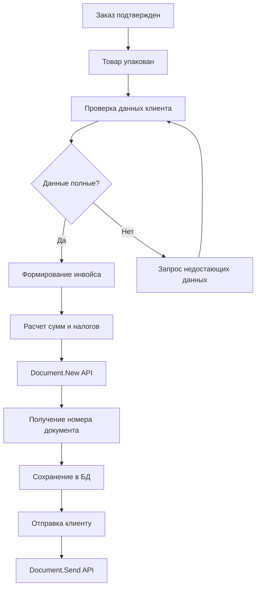

# Анализ системы счетов-фактур RIVHIT

## 📋 Обзор исследования
**Дата:** 14 августа 2025  
**Цель:** Изучение механизмов создания и хранения счетов-фактур в системе RIVHIT  
**Ограничения:** Только чтение данных, запись в БД RIVHIT строго запрещена

## 🔍 Основные выводы

### 1. API RIVHIT - Документная система

#### Базовый URL
```
https://api.rivhit.co.il/online/RivhitOnlineAPI.svc
```

#### Типы документов в системе
На основе анализа кода и API, выявлены следующие типы документов:

| ID | Тип документа | Название (HE) | Название (EN) | Описание |
|----|--------------|---------------|---------------|-----------|
| 1 | ORDER | הזמנה | Order/Quote | Заказ или коммерческое предложение |
| 2 | INVOICE | חשבונית | Invoice | Счет-фактура |
| 3 | DELIVERY | תעודת משלוח | Delivery Note | Накладная на доставку |
| 4 | RETURN | החזרה | Return | Возврат товара |
| 5 | RECEIPT | קבלה | Receipt | Квитанция об оплате |
| 6 | PROFORMA | פרופורמה | Proforma | Проформа-инвойс |
| 7 | ORDER_ITEMS | פרטי הזמנה | Order Details | Детали заказа с товарами |
| 8 | CREDIT | זיכוי | Credit Note | Кредит-нота |
| 9 | DEBIT | חיוב | Debit Note | Дебет-нота |
| 10 | STATEMENT | דוח | Statement | Отчет/выписка |

### 2. Методы создания документов

#### 2.1 Основные методы API

##### Создание документов (ЗАПРЕЩЕНО в нашей системе):
```
POST /Document.New
- Создание нового документа (инвойс, заказ, накладная)
- Параметры: тип документа, клиент, товары, суммы

POST /Document.NewExtended  
- Создание документа + квитанция
- Используется для одновременного создания счета и подтверждения оплаты

POST /Document.NewStream
- Создание документа с возвратом в виде потока (PDF/другой формат)

POST /Receipt.New
- Создание отдельной квитанции об оплате
```

##### Чтение документов (РАЗРЕШЕНО):
```
GET /Document.List
- Получение списка документов (по умолчанию за последние 6 месяцев)
- Фильтры: тип документа, даты, статус, клиент

GET /Document.Details
- Получение полной информации о документе
- Включает: товары, суммы, налоги, платежи

GET /Document.TypeList
- Получение списка всех типов документов в системе

GET /Document.Copy
- Получение ссылки на копию документа (PDF)
```

#### 2.2 Специализированные операции с инвойсами

```
POST /Document.InvoiceDecisionApproval
- Утверждение решения по счету-фактуре
- Используется в процессе согласования

POST /Document.InvoiceDecisionCancel
- Отмена решения по счету-фактуре
```

### 3. Структура хранения счетов-фактур

#### 3.1 Основные поля документа-инвойса

```typescript
interface RivhitInvoice {
  // Идентификация
  document_id: number;           // Уникальный ID в системе
  document_number: string;       // Номер документа (INV-2025-0001)
  document_type: 2;              // Тип = 2 (Invoice)
  
  // Даты
  issue_date: Date;              // Дата выставления
  due_date: Date;                // Срок оплаты
  payment_date?: Date;           // Фактическая дата оплаты
  
  // Клиент
  customer_id: number;           // ID клиента
  customer_name: string;         // Название компании
  customer_vat: string;          // ИНН/VAT номер
  customer_address: string;      // Адрес
  
  // Финансы
  subtotal: number;              // Сумма без НДС
  vat_rate: number;              // Ставка НДС (17% в Израиле)
  vat_amount: number;            // Сумма НДС
  total_amount: number;          // Итоговая сумма
  currency: string;              // Валюта (ILS/USD/EUR)
  
  // Статус
  status: number;                // 1-Draft, 2-Issued, 3-Sent, 4-Paid, 5-Cancelled
  payment_status: string;        // unpaid/partial/paid
  
  // Товары/услуги
  items: InvoiceItem[];          // Массив позиций
  
  // Метаданные
  created_by: number;            // ID создателя
  created_date: Date;            // Дата создания
  updated_date: Date;            // Дата изменения
  notes?: string;                // Примечания
  reference?: string;            // Ссылка на заказ
}

interface InvoiceItem {
  line_id: number;               // Номер строки
  item_id: number;               // ID товара
  description: string;           // Описание
  quantity: number;              // Количество
  unit_price: number;            // Цена за единицу
  discount?: number;             // Скидка
  tax_rate: number;              // Ставка налога
  line_total: number;            // Итого по строке
}
```

#### 3.2 Процесс создания счета-фактуры



### 4. Принципы работы с инвойсами

#### 4.1 Безопасность
- **Read-only режим**: В нашей системе реализован только просмотр
- **Запрещенные методы**: Document.New, Document.Update, Document.Delete
- **Кэширование**: 5 минут для уменьшения нагрузки на API

#### 4.2 Бизнес-логика
1. **Последовательность**: Заказ (Type 1) → Накладная (Type 3) → Инвойс (Type 2)
2. **Валидация**: Проверка ИНН, адреса, банковских реквизитов
3. **Налоги**: Автоматический расчет НДС 17% (стандарт Израиля)
4. **Нумерация**: Автоматическая последовательная нумерация

#### 4.3 Хранение
- **Основная БД**: RIVHIT cloud database
- **Локальное кэширование**: SQLite для быстрого доступа
- **Документы**: PDF копии на сервере RIVHIT
- **Архивирование**: Автоматическое после 7 лет

### 5. Интеграция с системой упаковки

#### 5.1 Текущий процесс
```typescript
// Псевдокод процесса
async function processOrderToInvoice(orderId: string) {
  // 1. Получаем заказ
  const order = await api.getDocument(orderId, type: 7);
  
  // 2. Проверяем статус упаковки
  if (order.packing_status !== 'completed') {
    throw new Error('Order not packed');
  }
  
  // 3. Подготавливаем данные для инвойса
  const invoiceData = {
    document_type: 2,
    customer_id: order.customer_id,
    items: order.items.map(item => ({
      ...item,
      quantity: item.packed_quantity // Фактически упакованное
    })),
    reference: order.document_number
  };
  
  // 4. ВАЖНО: В продакшене вызывается Document.New
  // В нашей системе - только подготовка данных
  return prepareInvoiceData(invoiceData);
}
```

#### 5.2 Места хранения инвойсов

1. **RIVHIT Cloud**:
   - Основное хранилище
   - Полная история изменений
   - Связи с другими документами

2. **Локальная БД (SQLite)**:
   - Таблица: `cached_documents`
   - Поля: document_id, document_type, data (JSON), cached_at
   - TTL: 300 секунд

3. **Файловая система**:
   - Путь: `/documents/invoices/{year}/{month}/`
   - Формат: PDF
   - Именование: `INV_{document_number}_{date}.pdf`

### 6. API эндпоинты для работы с инвойсами

#### 6.1 Внутренние эндпоинты (наша система)
```
GET /api/orders
- Параметр documentType=2 для фильтрации инвойсов

GET /api/documents/:id
- Получение деталей конкретного инвойса

GET /api/documents/export
- Экспорт инвойсов в Excel/CSV
```

#### 6.2 RIVHIT API эндпоинты
```
GET /Document.List?document_type=2
- Список всех инвойсов

GET /Document.Details?document_id={id}
- Полная информация об инвойсе

GET /Document.Copies?document_ids={ids}
- Пакетное получение копий

POST /Document.Send
- Отправка инвойса по email (ЗАПРЕЩЕНО)
```

### 7. Важные ограничения и правила

#### 7.1 Запрещенные операции
❌ Создание новых инвойсов через API  
❌ Изменение существующих инвойсов  
❌ Удаление инвойсов  
❌ Изменение статусов оплаты  
❌ Прямая запись в БД RIVHIT  

#### 7.2 Разрешенные операции
✅ Чтение списка инвойсов  
✅ Просмотр деталей инвойса  
✅ Экспорт в отчеты  
✅ Кэширование для производительности  
✅ Подготовка данных для инвойса (без отправки)  

### 8. Обнаруженные паттерны

#### 8.1 Naming Convention
- Инвойсы: `INV-YYYY-NNNNN` (например, INV-2025-00123)
- Квитанции: `REC-YYYY-NNNNN`
- Кредит-ноты: `CRD-YYYY-NNNNN`

#### 8.2 Статусы документов
```javascript
const DocumentStatus = {
  1: 'Draft',        // Черновик
  2: 'Issued',       // Выпущен
  3: 'Sent',         // Отправлен
  4: 'Paid',         // Оплачен
  5: 'Cancelled',    // Отменен
  6: 'Overdue',      // Просрочен
  7: 'Partial'       // Частично оплачен
};
```

#### 8.3 Связи между документами
- Order (Type 7) → Invoice (Type 2): через поле `reference`
- Invoice → Receipt (Type 5): через поле `payment_reference`
- Invoice → Credit Note (Type 8): через поле `original_invoice`

### 9. Рекомендации по безопасной работе

1. **Всегда используйте SafeRivhitService** для read-only операций
2. **Кэшируйте данные** для снижения нагрузки на API
3. **Логируйте все операции** с инвойсами
4. **Валидируйте данные** перед подготовкой инвойса
5. **Используйте транзакции** при работе с локальной БД

### 10. Выводы

Система RIVHIT предоставляет полнофункциональное API для работы с инвойсами, включая:
- Создание, чтение, обновление, удаление
- Отправку клиентам
- Интеграцию с платежными системами
- Автоматическую генерацию PDF

Наша система упаковки интегрирована с RIVHIT в режиме read-only, что обеспечивает:
- Безопасность данных
- Отсутствие риска повреждения БД
- Возможность просмотра и анализа
- Подготовку данных для будущих инвойсов

**Важно**: Фактическое создание инвойсов должно выполняться только через официальный интерфейс RIVHIT или авторизованными пользователями с соответствующими правами.

---

## Приложение: Примеры кода

### Получение списка инвойсов (безопасный метод)
```typescript
async function getInvoicesSafely(fromDate: string, toDate: string) {
  const safeService = new SafeRivhitService(apiToken);
  
  const filters = {
    document_type: 2, // Invoice
    date_from: fromDate,
    date_to: toDate,
    limit: 50
  };
  
  try {
    const invoices = await safeService.getDocuments(filters);
    
    // Кэшируем для быстрого доступа
    await cacheService.set('invoices', invoices, 300);
    
    return invoices;
  } catch (error) {
    console.error('Failed to fetch invoices:', error);
    // Возвращаем из кэша если есть
    return cacheService.get('invoices') || [];
  }
}
```

### Подготовка данных для инвойса (без создания)
```typescript
function prepareInvoiceData(order: Order): InvoiceData {
  return {
    document_type: 2,
    customer: {
      id: order.customer_id,
      name: order.customer_name,
      vat: order.customer_vat,
      address: order.customer_address
    },
    items: order.items.map(item => ({
      item_id: item.id,
      description: item.description,
      quantity: item.packed_quantity,
      unit_price: item.price,
      tax_rate: 0.17, // 17% VAT
      line_total: item.packed_quantity * item.price * 1.17
    })),
    totals: {
      subtotal: calculateSubtotal(order.items),
      vat: calculateVAT(order.items),
      total: calculateTotal(order.items)
    },
    reference: order.document_number,
    notes: `Created from order ${order.document_number}`
  };
}
```

---

**Документ подготовлен**: 14.08.2025  
**Автор**: System Analyst  
**Статус**: Research Only - No Write Operations